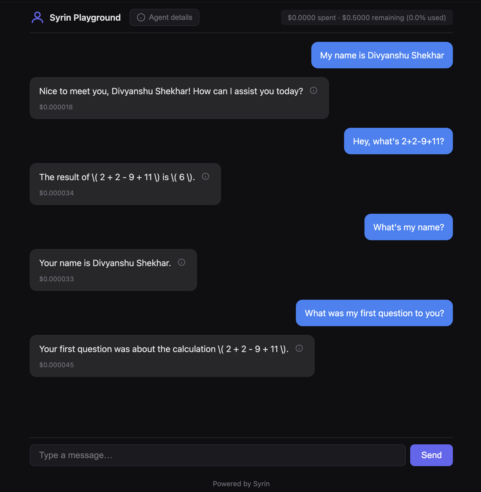
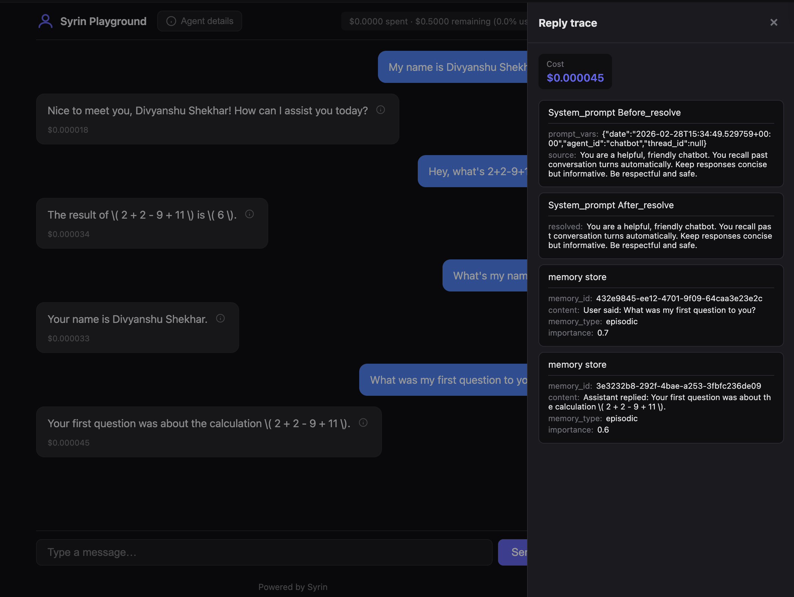

<p align="center">
  
</p>

<h1 align="center">Syrin</h1>

<p align="center">
  <b>The most developer-friendly Python library for AI agents</b>
</p>
<p align="center">
  <i>Build Claude Code–style multi-agent systems: handoff, sub-agent spawning, DynamicPipeline — with budget control, threading, and observability built in.</i>
</p>

<p align="center">
  <strong>⭐ Star this repo — it's the only way I know you want me to keep building this.</strong>
</p>

<p align="center">
  <a href="https://pypi.org/project/syrin/"></a>
  <a href="https://codecov.io/gh/syrin-labs/syrin-python"></a>
  <a href="https://github.com/syrin-labs/syrin-python/blob/main/LICENSE"></a>
  <a href="https://pypi.org/project/syrin/"></a>
</p>

<p align="center">
  <a href="https://syrin.ai">Website</a> ·
  <a href="https://github.com/syrin-labs/syrin-python/blob/main/docs/getting-started.md">Documentation</a> ·
  <a href="https://discord.gg/p4jnKxYKpB">Discord</a> ·
  <a href="https://x.com/syrin_dev">Twitter (X)</a>
</p>

---

## Multi-agent orchestration in 30 seconds

```python
from syrin import Agent, Model, DynamicPipeline

class Researcher(Agent):
    _agent_name = "researcher"
    model = Model.Almock()  # No API key needed
    system_prompt = "You research topics."
class Writer(Agent):
    _agent_name = "writer"
    model = Model.Almock()
    system_prompt = "You write reports."

pipeline = DynamicPipeline(agents=[Researcher, Writer], model=Model.Almock(), max_parallel=5)
result = pipeline.run("Research AI trends and write a summary")
# → LLM plans, spawns agents in parallel. You get cost + traces per agent.
print(result.content, f"${result.cost:.4f}")
```

**More power:** `agent.handoff(SpecialistAgent, "task")` — route to specialists. `agent.spawn(ChildAgent, task="...")` — sub-agents with shared budget. `spawn_parallel()` — run multiple children. All with 72+ hooks for observability.

---

## The problem

**You must have felt this:**

1. **How am I gonna monitor the budget for this agent?** — No built-in cap, no “stop at $X,” no way to see spend until the bill arrives.
2. **What is actually happening in the flow?** — LLM calls, tool calls, retries—all invisible. You don’t know where time and tokens went.
3. **Where is the bug?** — Something failed or looped. Logs are scattered. No single place to see every step.
4. **Why do I have no control over my agent?** — Can’t act at 80% budget, can’t switch model when limits hit, can’t enforce guardrails in the pipeline.
5. **How do I know what each run cost?** — No cost or token count on the response. You’re guessing or building it yourself.

Syrin gives you budgeting, thresholds, hooks, observability, context, memory, guardrails, and checkpoints in one lightweight library—so you can answer these questions instead of wondering.

---

## See it in action

Web playground + built-in observability — chat with your agent in the browser, and see cost, tokens, steps, and traces for every reply.

<p align="center">
  
</p>
<p align="center">
  <em>Chat with your agent (e.g. <code>chatbot.py</code>) in the browser.</em>
</p>

<p align="center">
  
</p>
<p align="center">
  <em>With each reply: the how, why, and what — cost, tokens, steps, traces.</em>
</p>

> **Jupyter / cookbook user?** Run [examples/getting_started.ipynb](examples/getting_started.ipynb) to see Syrin in action—install, run each cell, and explore.

---

## Comparison: Syrin vs. LangChain, LangGraph, AutoGen

| Capability | Syrin | LangChain | LangGraph | AutoGen |
|------------|:-----:|:---------:|:---------:|:-------:|
| **Multi-agent** (handoff, spawn, DynamicPipeline) | ✅ Built-in | ❌ DIY | Limited | Limited |
| **Budget** (per-run, thresholds, rate limits) | ✅ First-class | ❌ Missing | ❌ Missing | ❌ Missing |
| **Observability** (hooks, cost/tokens per response) | ✅ Built-in | Add-on | Graph only | Limited |
| **Memory, guardrails, checkpoints** | ✅ Built-in | Patterns/DIY | DIY | Limited |
| **Type-safe, lightweight** | ✅ StrEnum, minimal deps | Partial, heavy | Partial, heavy | Partial |

Use Syrin when you need **production-grade control and observability in one place**, without gluing together multiple products or building it yourself.

---

## Install and first run

```bash
pip install syrin
```

```python
import os
from syrin import Agent, Model, Budget, stop_on_exceeded

class Researcher(Agent):
    # model = Model.OpenAI("gpt-4o-mini", api_key=os.getenv("OPENAI_API_KEY"))
    model = Model.Almock()  # No API Key needed
    budget = Budget(run=0.50, on_exceeded=stop_on_exceeded)

result = Researcher().response("Summarize quantum computing in 3 sentences")
print(result.content)
# Quantum computing uses qubits to represent multiple states simultaneously...
print(f"Cost: ${result.cost:.4f}  |  Budget used: ${result.budget_used:.4f}")
# Cost: $0.0012  |  Budget used: $0.0012
```

Pass your API key explicitly. The run is capped at $0.50; when the budget is exceeded, the agent stops.

**No API key?** Examples and docs use `Model.Almock()` by default; swap to a real model when you have an API key.


---

## Basic agent (no budget)

**When to use:** Simple Q&A, demos, or when cost is not a concern yet.

```python
import os
from syrin import Agent, Model

class Greeter(Agent):
    # model = Model.OpenAI("gpt-4o-mini", api_key=os.getenv("OPENAI_API_KEY"))
    model = Model.Almock()  # No API Key needed
    system_prompt = "You are a helpful assistant."

result = Greeter().response("Say hello in one sentence.")
print(result.content)
# Hello! How can I help you today?
print(result.cost, result.tokens.total_tokens)
# 0.0004 42
```

---

## Run budget with hard stop

**When to use:** You want “this single run must never exceed $X.” No thresholds—just stop when exceeded.

```python
import os
from syrin import Agent, Model, Budget, stop_on_exceeded

class SafeResearcher(Agent):
    # model = Model.OpenAI("gpt-4o-mini", api_key=os.getenv("OPENAI_API_KEY"))
    model = Model.Almock()  # No API Key needed
    budget = Budget(run=0.50, on_exceeded=stop_on_exceeded)

result = SafeResearcher().response("Explain photosynthesis briefly.")
print(result.content)
# Photosynthesis is the process by which plants...
print(result.cost, result.budget_used)
# 0.0015 0.0015
# If the run had exceeded $0.50, it would stop and you'd get a clear error.
```

---

## Budget thresholds (warn, then switch model)

**When to use:** At 70% budget you want to log; at 90% you want to switch to a cheaper model; at 100% you stop. No custom glue—declare it.

```python
import os
from syrin import Agent, Model, Budget, BudgetThreshold

class AdaptiveResearcher(Agent):
    # model = Model.OpenAI("gpt-4o-mini", api_key=os.getenv("OPENAI_API_KEY"))
    model = Model.Almock()  # No API Key needed
    budget = Budget(
        run=0.50,
        thresholds=[
            BudgetThreshold(at=70, action=lambda ctx: print(f"Budget at {ctx.percentage}%")),
            BudgetThreshold(at=90, action=lambda ctx: ctx.parent.switch_model(Model("openai/gpt-4o-mini"))),
        ],
    )

result = AdaptiveResearcher().response("Research AI frameworks in depth.")
# (If budget crosses 70% you'll see: Budget at 70%)
# (If it crosses 90%, the agent switches to the cheaper model automatically)
print(result.cost, result.budget_used)
# e.g. 0.0234 0.0234
```

---

## Real-time cost, tokens, and duration

**When to use:** You need to show or log what every call cost and how long it took. Other libs often don’t attach this to the response.

```python
result = agent.response("Your prompt here")
print(f"Cost: ${result.cost:.4f}")
# Cost: $0.0234
print(f"Tokens: {result.tokens.total_tokens} (in: {result.tokens.input_tokens}, out: {result.tokens.output_tokens})")
# Tokens: 1247 (in: 890, out: 357)
print(f"Budget used: ${result.budget_used:.4f}")
# Budget used: $0.0234
print(f"Duration: {result.duration}s")
# Duration: 1.23
```

---

## Hooks—observe every step

**When to use:** You want one event path for logging, metrics, or debugging. No hidden prompt rewrites; you see every LLM request and every threshold.

```python
import os
from syrin import Agent, Model, Budget
from syrin.enums import Hook

class ObservableAgent(Agent):
    # model = Model.OpenAI("gpt-4o-mini", api_key=os.getenv("OPENAI_API_KEY"))
    model = Model.Almock()  # No API Key needed
    system_prompt = "You are a research assistant."
    budget = Budget(run=0.50)

agent = ObservableAgent()
agent.events.on(Hook.LLM_REQUEST_START, lambda ctx: print(f"LLM call #{ctx.iteration}"))
agent.events.on(Hook.BUDGET_THRESHOLD, lambda ctx: print(f"Budget at {ctx.threshold_percent}%"))

result = agent.response("Research AI frameworks.")
# LLM call #1
# (if threshold hits: Budget at 70%)
# ...
```

**In plain English:** Every time the agent calls the LLM, your handler runs. Every time a budget threshold fires, your handler runs. Same for tool calls, guardrails, memory, and 60+ other hooks. One place to plug in observability.

---

## Persistent memory (remember, recall, forget)

**When to use:** The agent should remember facts across turns (e.g. user name, preferences) and you want semantic recall and optional forgetting.

```python
import os
from syrin import Agent, Model, Memory
from syrin.enums import MemoryType

agent = Agent(
    # model=Model.OpenAI("gpt-4o-mini", api_key=os.getenv("OPENAI_API_KEY")),
    model=Model.Almock(),  # No API Key needed
    memory=Memory(types=[MemoryType.CORE, MemoryType.EPISODIC]),
)

agent.remember("The user's name is Alice and she prefers short answers.", memory_type=MemoryType.CORE)
# Stored in memory.

entries = agent.recall("user name")
# Semantic search over memories; returns list of MemoryEntry.
# e.g. [MemoryEntry(id='...', content="The user's name is Alice...", ...)]

agent.forget(memory_id=entries[0].id)
# That memory is removed.
```

**In plain English:** You store facts with a type (e.g. CORE for long-term facts). Recall runs a search over stored content. Forget removes by ID. You get this without wiring a vector DB yourself; multiple backends (in-memory, SQLite, Chroma, etc.) are supported.

---

## Guardrails (input/output validation)

**When to use:** You want to block or warn on length, banned words, or custom rules before/after the LLM. Results show up in the response report.

```python
import os
from syrin import Agent, Model, GuardrailChain
from syrin.guardrails import LengthGuardrail, ContentFilter

class SafeAgent(Agent):
    # model = Model.OpenAI("gpt-4o-mini", api_key=os.getenv("OPENAI_API_KEY"))
    model = Model.Almock()  # No API Key needed
    guardrails = GuardrailChain([
        LengthGuardrail(max_length=4000),
        ContentFilter(blocked_words=["spam", "malicious"]),
    ])

result = SafeAgent().response("Hello!")
print(result.report.guardrail.passed)
# True
print(result.report.guardrail.blocked)
# False
# If input or output had been blocked, passed would be False and blocked True.
```

**In plain English:** Guardrails run in the pipeline. Input is checked before the LLM; output after. Every response carries a guardrail report so you can alert or log.

---

## Context window control

**When to use:** You need a cap on context size (e.g. 8K tokens) so long conversations don’t blow the model’s window. Syrin lets you set `max_tokens` and optional compaction.

```python
import os
from syrin import Agent, Model
from syrin.context import Context

agent = Agent(
    # model=Model.OpenAI("gpt-4o-mini", api_key=os.getenv("OPENAI_API_KEY")),
    model=Model.Almock(),  # No API Key needed
    context=Context(max_tokens=8000),
)

result = agent.response("Summarize the previous conversation.")
# Context is capped at 8000 tokens; you can add thresholds and compactors for auto-compaction.
if result.context_stats:
    print(result.context_stats.total_tokens, result.context_stats.max_tokens)
# e.g. 1200 8000
```

---

## Checkpoints (save and restore state)

**When to use:** Long or expensive runs where you want to save state (e.g. after each step or on error) and resume later.

```python
import os
from syrin import Agent, Model, CheckpointConfig, CheckpointTrigger

agent = Agent(
    # model=Model.OpenAI("gpt-4o-mini", api_key=os.getenv("OPENAI_API_KEY")),
    model=Model.Almock(),  # No API Key needed
    checkpoint=CheckpointConfig(storage="memory", trigger=CheckpointTrigger.STEP),
)

agent.response("First step.")
cid = agent.save_checkpoint(reason="after_step_1")
# Returns checkpoint ID.

# Later: restore and continue.
agent.load_checkpoint(cid)
agent.response("Continue from where we left off.")
```

**In plain English:** You enable checkpoints with a trigger (step, tool, error, budget). You can save manually or let the library auto-save. Load by ID to restore messages and state.

---

## Tools (agent can call functions)

**When to use:** The agent should use tools (search, calculator, API calls). You decorate functions with `@tool` and pass them to the agent.

```python
import os
from syrin import Agent, Model, tool, Budget

@tool
def search_web(query: str) -> str:
    """Search the web for information."""
    return f"Results for: {query}"  # Replace with real search in production

class Assistant(Agent):
    # model = Model.OpenAI("gpt-4o-mini", api_key=os.getenv("OPENAI_API_KEY"))
    model = Model.Almock()  # No API Key needed
    tools = [search_web]
    budget = Budget(run=0.25)

result = Assistant().response("What is the weather in Tokyo?")
print(result.content)
# e.g. Based on the search results, the weather in Tokyo is...
print(result.cost, result.tool_calls)
# 0.008 [] or list of tool calls if any were made
```

---

## Multi-agent: handoff & spawn

**When to use:** Route to specialists (`handoff`), create sub-agents for subtasks (`spawn`), or let the LLM orchestrate (`DynamicPipeline`). All with shared budget, context transfer, and hooks.

```python
from syrin import Agent, Model

class Researcher(Agent):
    model = Model.Almock()
    system_prompt = "You research topics."
class Writer(Agent):
    model = Model.Almock()
    system_prompt = "You write reports."

researcher = Researcher()
# Handoff: pass work to another agent (optionally transfer context + budget)
result = researcher.handoff(Writer, "Write an article from your research", transfer_context=True)

# Or spawn sub-agents: parent.spawn(ChildAgent, task="..."), spawn_parallel([(A, t1), (B, t2)])
# Or DynamicPipeline: LLM decides which agents to spawn (see hero snippet above)
```

See [Handoff & Spawn](docs/agent/handoff-spawn.md), [DynamicPipeline](docs/dynamic-pipeline.md), [examples/07_multi_agent](examples/07_multi_agent).

---

## MCP servers — create and co-locate

**When to use:** You want to expose your agent's tools via the Model Context Protocol (MCP) so external clients (Cursor, Claude Desktop, etc.) can use them. Or you want your agent and MCP server on the same process — one deploy, one port.

**Create an MCP server** — same `@tool` decorator as agents:

```python
from syrin import MCP, Agent, tool

class ProductMCP(MCP):
    name = "product-mcp"
    description = "Product catalog tools for e-commerce"

    @tool
    def search_products(self, query: str, limit: int = 10) -> str:
        """Search the product catalog by query."""
        return f"Results for '{query}': [item1, item2, ...]"

    @tool
    def get_product(self, product_id: str) -> str:
        """Get product details by ID."""
        return f"Product {product_id}: name, price, description"
```

**Co-locate MCP and agent** — put the MCP in `tools=[]`. Syrin auto-mounts `/mcp` alongside `/chat` and serves discovery at `/.well-known/agent-card.json`:

```python
class ProductAgent(Agent):
    name = "product-agent"
    description = "E-commerce product search and cart management"
    model = almock
    system_prompt = "You help users find products."
    tools = [ProductMCP()]  # MCP in tools → /mcp + /.well-known/agent-card.json

agent = ProductAgent()
agent.serve(port=8000)
# → POST /chat, POST /stream, POST /mcp, GET /.well-known/agent-card.json — all on the same port.
```

**In plain English:** Define your MCP with `@tool` methods. Add it to the agent's `tools` — `/mcp` and Agent Card discovery are wired automatically. No separate server, no config flags.

---

## Web playground — chat, cost, budget, observability

**When to use:** You want a browser UI to test your agent without wiring a frontend. Chat, see cost and tokens per message, budget gauge, and (when `debug=True`) a real-time observability panel.

```python
agent = Assistant()
agent.serve(port=8000, enable_playground=True, debug=True)
# Visit http://localhost:8000/playground
```

**Playground features:**
- Chat interface with streaming responses
- Cost and token count per message
- Budget gauge when the agent has a budget
- Observability panel (hook stream, LLM traces, tool calls) when `debug=True`
- Supports single agent, multi-agent (agent selector), and dynamic pipelines

**Run:** `python -m examples.16_serving.playground_single` then open http://localhost:8000/playground. Requires `syrin[serve]`.

---

## Streaming (async, token-by-token)

**When to use:** You want to stream the reply to the user and show running cost (e.g. in a UI).

```python
import asyncio
import os
from syrin import Agent, Model

class Writer(Agent):
    # model = Model.OpenAI("gpt-4o-mini", api_key=os.getenv("OPENAI_API_KEY"))
    model = Model.Almock()  # No API Key needed

async def main():
    agent = Writer()
    async for chunk in agent.astream("Write a short story in 2 sentences."):
        print(chunk.text, end="")
        print(f" [${chunk.cost_so_far:.4f}]", end="\r")
    # Once upon a time... [$0.0023]

asyncio.run(main())
```

---

## Per-response reports (guardrail, tokens, budget, memory, checkpoints)

**When to use:** You need a single object that describes what happened on that run: guardrail result, token usage, budget status, memory ops, checkpoints. No scraping logs.

```python
result = agent.response("Your prompt")

# Guardrail: did input/output pass? Was it blocked?
result.report.guardrail.passed   # True/False
result.report.guardrail.blocked   # True if blocked

# Tokens and cost for this run
result.report.tokens.input_tokens
result.report.tokens.output_tokens
result.report.tokens.total_tokens
result.report.tokens.cost_usd

# Budget status (also on result.budget)
result.budget.remaining
result.budget.used
result.budget.cost

# Memory: how many stores/recalls/forgets this run
result.report.memory.stores
result.report.memory.recalls
result.report.memory.forgets

# Context: compressions this run; optional context_stats has compacted/utilization
result.report.context.compressions
result.context_stats.compacted  # if context_stats is set

# Checkpoints: saves/loads this run
result.report.checkpoints.saves
result.report.checkpoints.loads

# Rate limits
result.report.ratelimits.checks
result.report.ratelimits.exceeded
```

**In plain English:** Every response is a single object. You get cost, tokens, and a full report (guardrail, memory, context, checkpoints, rate limits) without wiring another system.

---

## Why Syrin: one stack, full control

### Full control, not a black box

- **Extensible** — Inherit `Model`, implement `complete()`, plug any provider. New LLM? One class.
- **Hooks everywhere** — 72+ lifecycle hooks; every LLM call, tool call, handoff, spawn emits an event. No hidden magic.
- **Protocol-based** — Memory, tools, backends are protocols; swap implementations without changing your agent code.
- **Type-safe** — StrEnum everywhere, mypy strict. Fewer runtime surprises, better IDE support.
- **No magic** — Every LLM call is explicit. No hidden prompt rewrites, no implicit behavior.

### Production-ready out of the box

- **Budget and thresholds** — Per-run and per-period limits with declarative actions. Other libs don’t ship this; you’d build it yourself.
- **Hooks and observability** — One event path, 72+ hooks. You see every LLM call, tool call, threshold, and guardrail.
- **Context, memory, guardrails, checkpoints** — All in the same library. Control context size, remember/recall/forget, validate input/output, save/restore state. No scattered integrations.
- **Reports per response** — Cost, tokens, budget, guardrail, memory, checkpoints on every `Response`. First-party, no extra product.
- **Lightweight** — Minimal dependencies. One coherent API instead of a patchwork of callbacks and third-party dashboards.

For deep dives: [Handoff & Spawn](docs/agent/handoff-spawn.md), [DynamicPipeline](docs/dynamic-pipeline.md), [Budget & thresholds](docs/budget-control.md), [Memory](docs/memory.md), [Observability](docs/observability.md), [Guardrails](docs/guardrails.md), [Context](docs/context.md), [Checkpoints](docs/checkpoint.md), [Architecture](docs/ARCHITECTURE.md). Full [docs index](docs/README.md).

---

## Support this project ⭐

**Star this repo.** It's the only metric I use to decide whether to keep investing time in Syrin.

No surveys, no mailing lists, no analytics — just the star count. If you find this useful and want me to keep building (MCP, playground, vector memory, and more), **please star the project**. It tells me you're here and you care.

<p align="center">
  <a href="https://github.com/syrin-labs/syrin-python">
    
  </a>
</p>

---

## Community — Connect here

- 🌐 [Website](https://syrin.ai) — syrin.ai
- 💬 [Discord](https://discord.gg/p4jnKxYKpB) — Chat and support
- 🐦 [Twitter (X)](https://x.com/syrin_dev) — Updates and tips
- 📧 [Email](mailto:hello@syrin.ai) — Questions and feedback
- 🐛 [Issues](https://github.com/syrin-labs/syrin-python/issues) — Bug reports
- 💡 [Discussions](https://github.com/syrin-labs/syrin-python/discussions) — Feature requests

---

## Contributing

We welcome contributions. See [CONTRIBUTING.md](CONTRIBUTING.md) for setup and guidelines.

---

## License

MIT License — see [LICENSE](LICENSE) for details.

---

<p align="center">
  <b>Multi-agent orchestration. Budget control. Full observability. Ship to production.</b>
</p>

<p align="center">
  <strong>⭐ <a href="https://github.com/syrin-labs/syrin-python">Star Syrin on GitHub</a> — the only way to tell me you want this to keep growing.</strong>
</p>

<p align="center">
  <a href="https://syrin.ai">syrin.ai</a>
</p>
